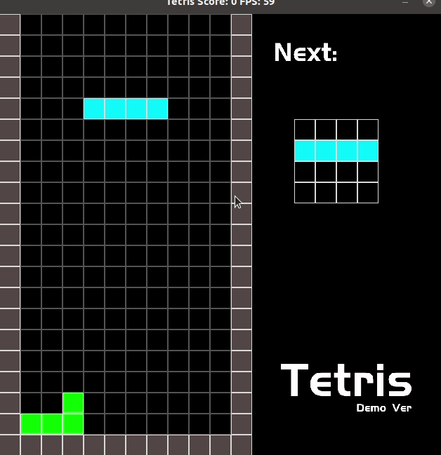

# CPPND: Tetris

This is a repo for the Capstone project in the [Udacity C++ Nanodegree Program](https://www.udacity.com/course/c-plus-plus-nanodegree--nd213).

I build a simple Tetris game. Contains complete game logic, colorful Tetris, and sign for the next block.

## Dependencies for Running Locally

* cmake >= 3.7

  * All OSes: [click here for installation instructions](https://cmake.org/install/)

* make >= 4.1 (Linux, Mac), 3.81 (Windows)

  * Linux: make is installed by default on most Linux distros

  * ## Mac: [install Xcode command line tools to get make](https://developer.apple.com/xcode/features/)

  * Windows: [Click here for installation instructions](http://gnuwin32.sourceforge.net/packages/make.htm)

* SDL2 >= 2.0

  * All installation instructions can be found [here](https://wiki.libsdl.org/Installation)

  >Note that for Linux, an `apt` or `apt-get` installation is preferred to building from source. 

* SDL2_image >= 2.0

  * All installation package can be found [here](https://www.libsdl.org/projects/SDL_image/)

  >A good resource of how to download the specific sdl you want is [here](https://gist.github.com/BoredBored/3187339a99f7786c25075d4d9c80fad5)
  >
  >Here I recommend: `sudo apt install libjpeg-dev libwebp-dev libtiff5-dev libsdl2-image-dev libsdl2-image-2.0-0 -y` If you use Linux.

* gcc/g++ >= 5.4

  * Linux: gcc / g++ is installed by default on most Linux distros
  * Mac: same deal as make - [install Xcode command line tools](https://developer.apple.com/xcode/features/)
  * Windows: recommend using [MinGW](http://www.mingw.org/)

## Basic Build Instructions

1. Clone this repo.
2. Make a build directory in the top level directory: `mkdir build && cd build`
3. Compile: `cmake .. && make`
4. Run it: `./Tetris`.

## File and Class Structure

## Rubric Points

- All points in README.
- All points in Compiling and Testing
- All points in Loops, Functions, I/O.
- Object Oriented Programming
  - Linux: gcc / g++ is installed by default on most Linux distros
  - Classes use appropriate access specifiers for class members.
  - Classes encapsulate behavior.
  - Classes follow an appropriate inheritance hierarchy.
  - Overloaded functions allow the same function to operate on different parameters.
- Memory Management
  - The project makes use of references in function declarations.
  - The project uses destructors appropriately.
  - The project uses scope / Resource Acquisition Is Initialization (RAII) where appropriate.
  - The project follows the Rule of 5.

- NO rubric points in Concurrency part.
